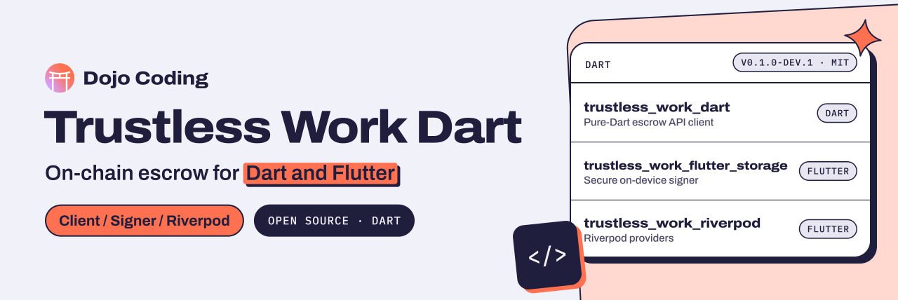

<p align="center">
  <a href="https://dojocoding.io">
    <picture>
      <source media="(prefers-color-scheme: dark)" srcset="docs/assets/banner-dark.svg">
      <source media="(prefers-color-scheme: light)" srcset="docs/assets/banner-light.svg">
      
    </picture>
  </a>
</p>

# Trustless Work Dart

**Dart and Flutter packages for builders who want to create, fund and release [Trustless Work](https://trustlesswork.com) escrows from their apps.**

[Trustless Work](https://trustlesswork.com) is the escrow platform these packages target: escrow funds live on-chain in USDC on Stellar/Soroban, and apps talk to its escrow API gateway. `trustless_work_dart` is a pure-Dart client for that gateway, and two Flutter companions add a secure on-device signer and Riverpod providers.

[](#packages) [](#license) [](https://dart.dev)

[Get started](#quickstart) · [Packages](#packages) · [Report an issue](https://github.com/DojoCodingLabs/trustless-work-dart/issues/new)

## Packages

| Package | Description | Version |
|---|---|---|
| [`trustless_work_dart`](trustless_work_dart/) ([README](trustless_work_dart/README.md)) | Pure-Dart client for the Trustless Work escrow API gateway on Stellar/Soroban. Works from Flutter, Jaspr, Dart server, or CLI. | `0.1.0-dev.1` |
| [`trustless_work_flutter_storage`](trustless_work_flutter_storage/) ([README](trustless_work_flutter_storage/README.md)) | Persistent on-device signer for Trustless Work built on flutter_secure_storage. Companion to trustless_work_dart. | `0.1.0-dev.1` |
| [`trustless_work_riverpod`](trustless_work_riverpod/) ([README](trustless_work_riverpod/README.md)) | Riverpod providers for Trustless Work escrow operations. Companion to trustless_work_dart. | `0.1.0-dev.1` |

## Quickstart

The packages are pre-release and not on pub.dev yet. The two Flutter companions depend on `trustless_work_dart` through a path dependency in this repository.

```dart
import 'package:trustless_work_dart/trustless_work_dart.dart';

final client = TrustlessWorkClient(
  config: TrustlessWorkConfig.testnet(apiKey: 'YOUR_KEY'),
  signer: myTransactionSigner,
);

final escrow = await client.initializeEscrow(myContract);
final funded = await client.fundEscrow(myFundPayload);
final released = await client.releaseFunds(myReleasePayload);
```

`signer` is any `TransactionSigner`: `trustless_work_dart` ships `KeyPairSigner` and `CallbackSigner`, and `trustless_work_flutter_storage` adds `SecureStorageKeyPairSigner`. Each package README covers its own setup.

## License

MIT for all three packages ([core](trustless_work_dart/LICENSE), [Flutter storage](trustless_work_flutter_storage/LICENSE), [Riverpod](trustless_work_riverpod/LICENSE)). Built by [Dojo Coding](https://dojocoding.io).

<p align="center">
  <a href="https://dojocoding.io"></a>
</p>
